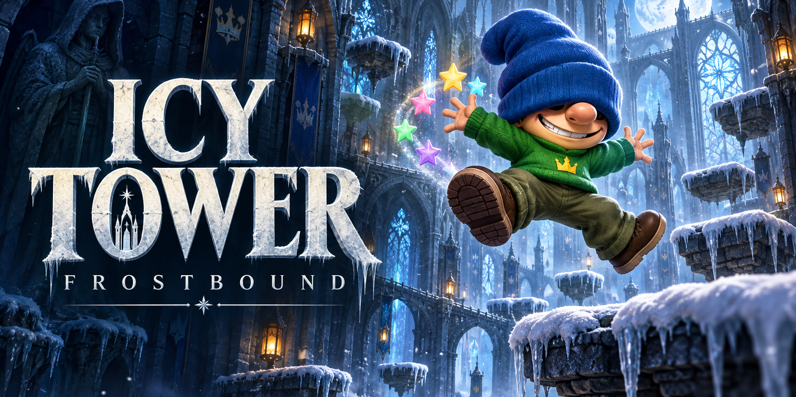

# Icy Tower — Frostbound

A playable 2.5D arcade tower climber. Three.js renders the scene; a fixed-step simulation owns movement, one-way ledges, momentum jumps, wall rebounds, full somersaults on fast jumps, crystals, combo chains, and the rising storm.

## Play

- A/D or left/right arrows: move
- Space, W, or up arrow: jump (press again for the next jump)
- Escape/P: pause
- Enter: begin/retry
- On phones and touch tablets: hold left/right with one thumb and tap JUMP with the other. Slide across the direction pad to turn; release JUMP before the next jump.

Run to jump higher. At high speed, Harold spreads his arms and legs into a star-shaped 360° spin and straightens before landing. Active combos leave a rotating, multicolored five-point star trail behind him. Land on new floors within 3.8 seconds to extend a combo. Arcade scrolling starts when you reach floor 5, making ledges descend even when you stand still. The pace increases every 30 seconds, up to five increases. The camera tracks downward falls to reveal recovery ledges, while the frost keeps advancing independently. Practice disables automatic scrolling; falling into the frost still ends the run. Personal records are saved on this browser.

Every 10th floor has a wooden number plaque on its front edge. Every 50th floor is a full-width landing stage, providing room to land and build momentum before the next climb. Stages still scroll toward the frost like other floors.

The layout supports portrait and landscape, device safe areas, and scrolling menus on short screens. Rotating the device or leaving the game pauses the run and clears held controls. Touch devices start in Performance quality; change quality from the main menu. Leaderboard dialogs adjust to the visible screen when the on-screen keyboard opens.

## Party mode

Choose **Party** from the mode selector before starting. Lower gravity gives jumps more airtime. Every fifth floor is a pink spring platform that automatically launches you higher when you land; the full-width 50-floor stages remain normal landing spots. Pink crystals grant **8 seconds of double jumps**: release and press jump again in midair for one extra jump per landing. Collect another crystal to refresh the timer. The HUD shows the time remaining and whether a jump is ready; pausing freezes the timer. The same controls work on keyboard and touch.

Party keeps the rising frost and combo scoring, with its own online rankings and browser personal best. Classic retains the original physics and rankings. Practice remains unranked and now saves its personal best separately, too. Existing browser records remain under Classic.

## Race your ghost

Finish an arcade climb to create a translucent blue replay of Harold. On subsequent arcade runs, the ghost repeats that climb alongside you on the same generated tower, including jumps and spins. The HUD shows your height lead in metres and celebrates passing its best floor. Pauses freeze the race, and the ghost never affects collisions, crystals, or scoring.

Your highest completed arcade climb becomes the next ghost; score, then shorter duration, break floor ties. One ghost is saved locally in this browser (or kept for the session if storage is unavailable). Practice and abandoned runs do not replace it. Old personal records have no recording, so complete a new run to create your first ghost. Recordings share the leaderboard limits of 30 minutes and 12,000 input changes; longer runs remain playable but cannot create a ghost.

## Leaderboard

Open the trophy button to see the all-time top 50 runs on the **Classic** or **Party** tab. After a completed Classic or Party run, choose **Submit score & leaderboard**, enter a public display name, and submit. Scores, floors, combos, and mode-specific physics are replayed and calculated on the server. The verified recording selects the board; Party scores cannot be submitted to Classic rankings. Legacy arcade recordings remain valid. Practice runs do not qualify; ranked recordings support up to 30 minutes and 12,000 input changes. Ties favor the higher floor, then the faster run.

The leaderboard uses a Netlify Function and site-wide Netlify Blobs storage, so scores persist across deployments and are shared across devices. Conditional writes protect concurrent submissions, and identical recordings cannot be added twice while on the board. Replay validation prevents fabricated score totals; it is not a guarantee against automated play. No login is required, and display names are not reserved identities. The name field is remembered only on the player's device.

The online API runs on Netlify; the plain Vite preview serves only the game frontend. `npm test` includes real local Blobs persistence, replay verification, request validation, and concurrent-write coverage.

## Development

`npm install`, then `npm run dev -- --port 5188`.

`npm test` checks jump height, landings, wall rebounds, buffering, coyote time, pause, frost, restart, downward camera tracking, recoverable falls, floor-triggered scrolling, 30-second acceleration, frame-rate independence, simultaneous touch and keyboard input, stage collisions, legacy and current leaderboard recordings, Party springs and gravity, timed double jumps, separate ranked storage, and a simulated 105-floor climb through five generated layouts.

`npm run typecheck`, `npm run lint`, and `npm run build` validate source and production output.

## Art and sound

- The cathedral interior is real 3D geometry: deep window bays, Gothic arches, masonry, side aisles, vault ribs, lanterns, and icicles. A fixed pool of architecture extends the tower as you climb. Perspective, drifting window light, light shafts, and snow provide depth and movement; no background image is used.
- `public/assets/harold.glb`: custom 3D recreation of the original Harold look: oversized blue beanie, green crown sweater, olive trousers, brown shoes, and a broad grin. Separate limb pivots support running, jumping, and star-shaped spins.
- `scripts/climber.blend`: editable Blender source.
- `scripts/build-climber.py`: rebuilds the character asset with Blender 5.2.
- Ledges and architectural geometry use physically based materials with procedural surface detail. Static meshes are batched by material.
- Wind, ambient tones, movement, and crystal sounds are synthesized locally. No audio service is required.

This is an independent Icy Tower-inspired browser prototype, with no original game assets or affiliation. It is not a commercial AAA release. High quality enables bloom and soft shadows; performance quality reduces rendering cost. WebGL is required.

## Validation notes

The gameplay simulation is covered by automated tests. The GLB is checked for a valid upright model and named animation pivots, and its Blender render is inspected. Motion checks cover full loops in both directions, extended limbs on the real model, takeoff speed, landing recovery, and paused animation. Trail checks cover emission, positioning behind the player, lifetime, pause, and reset. Interior checks cover bounded shared geometry and stable architecture through climbs, falls, and long runs. Browser visual and interactive QA have not been performed. Optional WebMCP actions are feature-detected; no supported WebMCP runtime was available to verify registration here.

## Netlify

Play: https://icy-tower-frostbound.netlify.app

The public GitHub repository is connected to Netlify. Pushes to `main` automatically build and publish the game.

`npm run build:netlify` produces a static export in `dist/client`. `netlify.toml` configures that build for Netlify. From the linked project, publish it with `netlify deploy --prod --dir=dist/client`. The normal development command and Sites build remain available.
